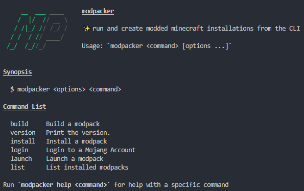

# modpacker

Modpacker is a modded minecraft installer and creator that runs entirely from the CLI



## Installation

Until binaries are created, you can install this via [npm](https://npmjs.org):

```bash
$ npm install -g modpacker
```

or, if you prefer yarn (like I do)

```bash
$ yarn global add modpacker
```

## Usage

### Building a modpack

First create `modpack.yaml` in your `.minecraft` directory where the modpack is currently "installed"

```yaml
version: 1.0.0
name: MODPACK_NAME
author: YOUR NAME <your@email.com>
minecraft:
  javaArgs: >-
    -Xmx8G -Xms2G -XX:+UnlockExperimentalVMOptions -XX:+UseG1GC
    -XX:G1NewSizePercent=20 -XX:G1ReservePercent=20 -XX:MaxGCPauseMillis=50
    -XX:G1HeapRegionSize=32M
  version: 1.12.2
forge:
  version: 14.23.5.2847
mods: []
```

Then run `modpacker build` inside of that directory, make sure that `mods` and `config` exists in that directory.

This will create two `.tar.gz` files in that directory, a server version and a client version. Your `.yaml` file
will have been edited to reflect the mods under the `mods` section. Set `client` to true if you want to ONLY include
this mod in the "client" version of the mod, i.e map mods, etc.

That's your modpack!

### Installing a modpack

Find your modpack online, or use a `file://` link to your modpack's location and supply that to
`modpack install`

This will take care of installing forge, installing the modpack, and creating a minecraft launcher profile for your modpack.

If you launch the Minecraft launcher, you will see your ModPack is available as the entry in `name` of the config.

### Developing

Make sure you have eslint installed to enforce style rules and better code in general.

To build binaries, run:

```bash
$ yarn build
```

Tests will be added one day, maybe.

## License

BSD-3-Clause